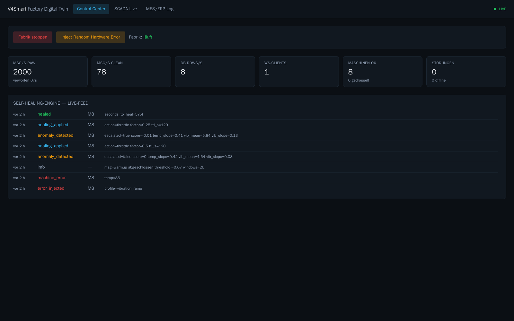
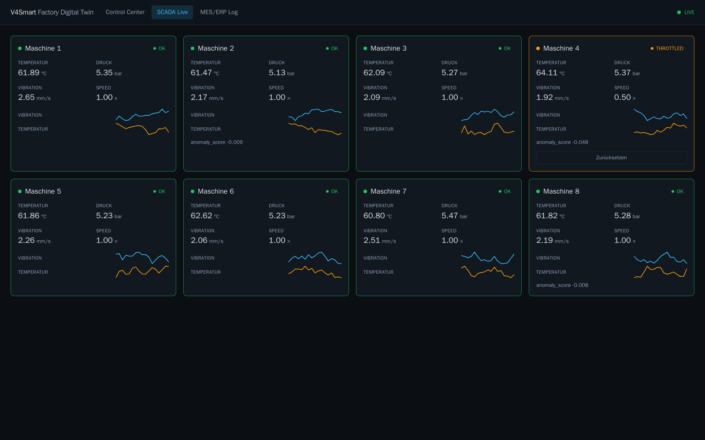
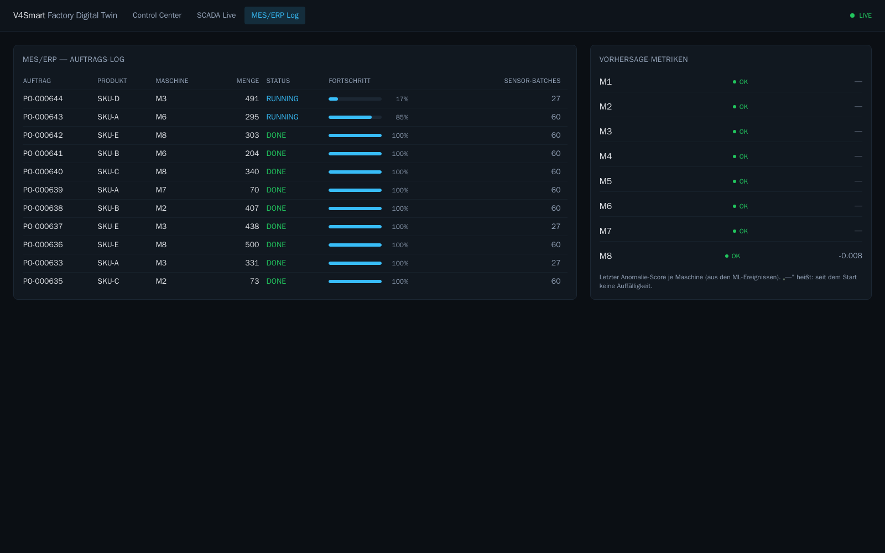

# V4Smart — Factory Digital Twin

An event-driven digital twin of a small factory: eight simulated SCADA machines
stream **2,000 sensor readings per second** through Redpanda, a Rust routing
engine validates and aggregates them into a QuestDB historian, a Python service
predicts bearing-type failures **before** they become critical and throttles the
affected machine automatically, and a React dashboard shows all of it live.

Everything runs in Docker. `make up` on an empty machine brings the whole stack
online in roughly ten seconds.



## Why it exists

Most "digital twin" demos show a dashboard with moving numbers. The interesting
part is the **closed loop**: an anomaly is detected from a leading indicator,
an action is taken automatically, the physical process responds, and the system
proves it recovered. This project implements that loop end to end and ships the
test that verifies it (`make test-healing`).

The simulated physics make the loop meaningful: vibration rises first, and
temperature follows with a ~25 s time constant. That lag is the prediction
window — the model sees the vibration slope long before the temperature becomes
dangerous.

**Measured on a single 4-core container budget:**

| | |
|---|---|
| Ingest | 2,000 msg/s sustained, 0 dropped (three consecutive measurements) |
| Detection | anomaly throttled 20–28 s after fault injection (model fires at ~16 s, the deterministic guard only at ~24 s) |
| Outcome | peak temperature 66.0–68.7 °C against an 85 °C failure threshold |
| Without the ML service | the same fault drives the machine into ERROR after 58 s at 85.7 °C |
| Broker kill | full recovery to 2,000 msg/s in 26 s, no manual intervention |
| Database outage | hot path unaffected, dropped rows counted and reported |
| Footprint | 1.86 GB RAM for the entire stack |

## Architecture

```
                        ┌─────────────────────────────────────────────────┐
                        │              Redpanda (event bus)               │
   ┌────────────────┐   │  sensor_raw ── sensor_clean ── mes_orders       │
   │ factory-       │──▶│  machine_control ── system_events               │
   │ simulator (Go) │◀──│                                                 │
   └────────────────┘   └───┬───────────▲───────────┬─────────────▲───────┘
     8 machines (SCADA)     │           │           │             │
     + MES generator        ▼           │           ▼             │
                    ┌──────────────┐    │    ┌──────────────┐     │
                    │ middleware-  │    │    │ predictive-  │─────┘
                    │ core (Rust)  │    │    │ ml (Python)  │  throttle command
                    │ filter/agg   │    │    │ IsolationFor.│  on machine_control
                    └──┬────────┬──┘    │    └──────────────┘
            ILP (9009) │        │ REST/WS (8080)
                       ▼        ▼       │
              ┌──────────┐   ┌──────────┴─┐      ┌───────┐
              │ QuestDB  │   │ dashboard- │◀─────│ Caddy │◀── https://TWIN_HOST
              │historian │   │ ui (React) │      │ TLS + │    (basic auth)
              └──────────┘   └────────────┘      │ auth  │
                                                 └───────┘
```

**Data flow**

1. The simulator produces FlatBuffers readings on `sensor_raw` (2,000 msg/s).
2. `middleware-core` consumes, validates, and aggregates them: one row per
   machine per second into QuestDB (ILP), plus a downsampled stream on
   `sensor_clean` for the ML service.
3. `predictive-ml` builds 10-second feature windows, scores them with an
   Isolation Forest, and publishes a throttle command on `machine_control`.
4. The simulator obeys the command — the fault decays, the machine recovers.
5. The dashboard talks only to `middleware-core` over REST and a WebSocket.

### Design decisions worth knowing

- **FlatBuffers on the hot path, JSON everywhere else.** `sensor_raw` and
  `sensor_clean` carry zero-parse binary payloads; the low-frequency control and
  event topics are JSON so they stay debuggable with `rpk topic consume`.
- **One writer.** Only `middleware-core` writes to QuestDB, which keeps the
  historian schema under a single owner.
- **The hot path never blocks.** The producer drops rather than back-pressures,
  the ILP writer discards rather than stalls, and slow WebSocket clients are
  disconnected. A dashboard on a bad connection cannot slow down ingestion.
- **The model is not load-bearing on its own.** A deterministic vibration guard
  runs alongside it, so the healing chain still works during warmup or if the
  model misbehaves — but the calibration ensures the *model* fires first, which
  is what buys the prediction window.
- **Stateless services.** Consumer groups and per-machine partition keys, no
  local state that cannot be rebuilt from the topics.

## Quick start

Requirements: Docker with Compose v2, ~4 CPU cores and ~8 GB RAM free.

```bash
cp .env.example .env          # defaults work as-is for local use
make up-infra                 # Redpanda, QuestDB, Console, topics
make smoke-infra              # verifies broker, topics, ILP write path

make codegen                  # FlatBuffers code for Go/Rust/Python
make up                       # build and start everything
make ps                       # all health checks green?
make smoke-sim                # simulator producing at the target rate?
```

Wait ~70 s for the ML warmup to finish, then run the test that matters:

```bash
make test-healing
```

It injects a hardware fault, prints a live timeline, and passes only if the
machine was throttled within 60 s, never reached 85 °C, and returned to `OK`.

```
== Observing self-healing (timeline, every 3 s) ==
  t+  0s  M1  status=OK         vib=2.53 mm/s  temp=62.9 °C
  t+ 20s  M1  status=OK         vib=4.89 mm/s  temp=64.9 °C
  t+ 24s  M1  status=THROTTLED  vib=4.68 mm/s  temp=65.6 °C
  ...
  t+149s  M1  status=OK         vib=1.94 mm/s  temp=61.7 °C

PASS — anomaly detected -> throttled (t+24s) -> healed (t+149s), peak 66.5 °C
```

### Useful commands

```bash
make logs s=middleware-core   # follow one service
make stats                    # live rates (in/clean/db rows/s)
make topics                   # topics and high watermarks
make nuke                     # remove everything including volumes
```

## The dashboard

Three views, all fed by a single WebSocket with automatic reconnect and snapshot
resync. React re-renders are throttled to 4 Hz while telemetry arrives at 40
frames per second, so the page stays smooth.

**SCADA Live** — machine cards with status-coloured borders, a pulse indicator
per received frame, and 60-point SVG sparklines (no charting library). A
throttled or failed machine gets a reset button: both states clear themselves
after ~120 s, but nobody wants to wait that out during a demo.



**MES/ERP Log** — order table with progress bars and a per-machine sensor-batch
counter, plus the latest anomaly score per machine.



## Services

| Service | Stack | Role |
|---|---|---|
| `factory-simulator` | Go 1.23, franz-go | Ornstein–Uhlenbeck physics for 8 machines, vibration→temperature coupling, fault profiles, MES order generation, reacts to control commands |
| `middleware-core` | Rust, rdkafka, axum, tokio | Validation, 1-second aggregates, QuestDB ILP writer with reconnect, downsampling, REST + WebSocket API |
| `predictive-ml` | Python 3.12, scikit-learn | Sliding feature windows, Isolation Forest with calibrated threshold, deterministic guard, cooldown and escalation logic |
| `dashboard-ui` | React 18, Vite, TypeScript, Tailwind | Three live views, served as a static bundle by nginx |

Each backend image ships a `selfcheck` executable used by the Compose health
checks, so a container is only "healthy" once its own endpoint answers.

## Data contracts

`schemas/sensor_reading.fbs` defines the hot-path payload (`file_identifier
"SNR1"`). Generated code for all three languages is committed; regenerate with
`make codegen` after changing the schema.

| Topic | Partitions | Format | Producer → Consumer |
|---|---|---|---|
| `sensor_raw` | 16 | FlatBuffers | simulator → middleware-core |
| `sensor_clean` | 16 | FlatBuffers | middleware-core → predictive-ml |
| `mes_orders` | 3 | JSON | simulator → middleware-core |
| `machine_control` | 3 | JSON | ml + core → simulator |
| `system_events` | 3 | JSON | ml + simulator → middleware-core |

Kafka keys are the ASCII decimal machine id, so all readings of one machine land
on the same partition and stay ordered.

**REST** (`middleware-core`, port 8080): `/api/health`, `/api/machines`,
`/api/orders`, `/api/events`, `/api/stats`, `POST /api/control`.
**WebSocket** (`/ws`): one `snapshot` frame on connect, then `telemetry`,
`event`, `order` and 1 Hz `stats` frames.

## Testing

```bash
# Go — physics and MES logic (fast-forwarded simulation time, no sleeps)
docker run --rm -v "$PWD/services/factory-simulator:/s" -w /s golang:1.23-alpine go test ./...

# Rust — validation, aggregation, ILP line format
docker run --rm -v "$PWD/services/middleware-core:/s" -w /s rust:1.85-bookworm cargo test

# Python — features, detection scenario, actor contracts
docker run --rm -v "$PWD/services/predictive-ml:/s" -w /s python:3.12-slim \
  sh -c "pip install -q -r requirements.txt pytest && python -m pytest -q tests/"
```

The Python suite includes the two tests that actually pin the behaviour: a
scenario test that must detect a ramp within 20 s, and a false-positive test
that runs 10 minutes of normal operation across three random seeds and must
raise **zero** alarms.

`services/predictive-ml/tools/calibrate.py` sweeps the detection threshold and
prints both sides of the trade-off, which is how the current value was chosen
rather than guessed:

```
 margin  threshold  false alarms  detected_s  guard?
    0.0     +0.032            19         9.9   False
    1.0     -0.069             3         9.9   False
    1.5     -0.122             0        16.2   False   <- chosen
    2.0     -0.157             0        24.6   True    <- only the guard fires
```

## Configuration

All tuning lives in `.env` (see `.env.example`): machine count, target rate,
downsample and WebSocket rates, ML warmup, cooldown and guard threshold.

## Exposing the stack

The `edge` profile runs Caddy, which terminates TLS and enforces basic auth for
all three hostnames:

```bash
make hash-password pw='YOUR_PASSWORD'   # paste the hash into .env
docker compose --profile edge up -d caddy
```

Two things that will cost you an hour if you hit them blind:

- **Escape `$` as `$$` in the bcrypt hash** inside `.env`. Compose otherwise
  interprets `$2a$14$...` as variable references and silently shortens the hash
  from 60 to 40 characters — every login then fails with 401 despite the correct
  password.
- **Behind an existing reverse proxy**, publish the edge on alternative ports
  and prefix the site addresses in the `Caddyfile` with `http://`. Without that
  prefix Caddy answers the upstream proxy with a 308 redirect to https and the
  two proxies loop.

## Engineering notes

A few defects that only surfaced against the running system, kept here because
they generalise:

- **A dead database looked healthy.** `write_all` on a closed ILP socket keeps
  returning `Ok` — the kernel buffers the bytes. `/api/stats` therefore reported
  a steady `db_rows_s: 8` while rows were being lost. The writer now probes the
  peer before each batch and reports `db_dropped_total`. An outage your metrics
  do not show is worse than the outage.
- **A screenshot caught what tests could not.** The order table listed the same
  order four times with 0 %, 52 % and 100 % simultaneously: the snapshot carries
  every status message, and only the live frames were being deduplicated.
- **Escalation fired reflexively.** The healing chain escalated to a harder
  throttle four seconds after the first one — while vibration was already
  falling. The 10-second averaging window simply lagged behind the action, so
  the guard stayed tripped. Escalation now requires the window to have refreshed
  *and* vibration not to be decreasing.
- **The model was silently sidelined.** With too wide a safety margin the
  threshold fell below the score range the Isolation Forest can produce, so
  detection quietly degraded to the deterministic guard alone — everything still
  "passed", just 8 seconds later and without any prediction.

## Licence

MIT — see [LICENSE](LICENSE).
